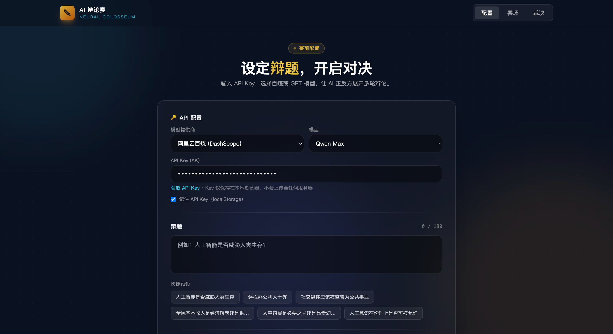

# AI Debate Arena

**AI 辩论赛** — 一场由大模型驱动的全自动辩论体验。

在浏览器中设定辩题，让正方 AI 与反方 AI 按标准赛制展开多轮交锋，并由 AI 裁判给出胜负裁决与评分。支持 **阿里云百炼（DashScope）** 与 **OpenAI GPT**，API Key 由用户在页面自行填写，纯前端调用，无需后端服务。

[English TL;DR](#english) · [预览](#预览) · [快速开始](#快速开始) · [联系与交流](#联系与交流) · [赛制说明](#赛制说明) · [项目结构](#项目结构)

---

## 特性

- **真实 AI 辩论**：通过 OpenAI 兼容接口流式生成辩词，非模板拼接
- **双模型提供商**：阿里云百炼（Qwen 系列）/ OpenAI（GPT 系列）
- **BYOK（Bring Your Own Key）**：在配置页输入 API Key，仅存于浏览器 `localStorage`
- **完整赛制流程**：立论 → 攻辩 → 自由辩论 → 总结陈词 → AI 裁判裁决
- **沉浸式 UI**：深色科技风界面、打字机效果、发言高亮、环节倒计时、过渡动画
- **零后端依赖**：静态 HTML + ES Module，任意静态服务器即可部署
- **开源友好**：代码结构清晰，易于二次开发与定制 Prompt

---

## 预览

### 演示视频

<video controls width="100%" src="./docs/demo.mp4">
  您的浏览器不支持内嵌播放，请<a href="./docs/demo.mp4">点击下载演示视频</a>观看。
</video>

> 演示视频：`docs/demo.mp4`（1280p · 约 3.5 分钟）· 展示从配置辩题到 AI 正反方辩论的完整流程。

### 界面截图

<p align="center">
  
</p>

<p align="center">
  <sub>配置页：选择百炼 / GPT 模型，输入 API Key，设定辩题与辩论节奏</sub>
</p>

| 配置页 | 辩论赛场 | 裁决结果 |
|--------|----------|----------|
| 设置辩题、API Key、模型与节奏 | 双栏实时辩论、计时与环节进度 | 裁判点评、评分对比、完整辩词记录 |

> 启动本地服务后访问 `http://localhost:3456` 即可体验。

---

## 快速开始

### 环境要求

- 现代浏览器（Chrome / Edge / Firefox / Safari 最新版）
- Node.js 18+（仅用于启动本地静态服务器，可选其他方式）
- 有效的 **百炼** 或 **OpenAI** API Key

### 安装与运行

```bash
# 克隆仓库
git clone https://github.com/<your-username>/AI_Debate_Arena.git
cd AI_Debate_Arena

# 启动本地静态服务（默认端口 3456）
npm start
```

浏览器打开：**http://localhost:3456**

> **注意**：请勿直接双击打开 `index.html`。项目使用 ES Module，需通过 HTTP 服务访问。

### 其他启动方式

```bash
# Python 3
python3 -m http.server 3456

# 或使用任意静态托管工具
npx serve . -p 3456
```

---

## 使用指南

### 1. 配置 API Key

#### 阿里云百炼（推荐，浏览器直连友好）

1. 前往 [百炼控制台 · API Key](https://bailian.console.aliyun.com/?tab=api#/api-key) 创建 Key
2. 在配置页选择 **「阿里云百炼 (DashScope)」**
3. 选择模型（如 `qwen-plus`、`qwen-max`）
4. 粘贴 API Key（格式通常为 `sk-...`）

默认请求地址：

```text
https://dashscope.aliyuncs.com/compatible-mode/v1/chat/completions
```

#### OpenAI GPT

1. 前往 [OpenAI API Keys](https://platform.openai.com/api-keys) 创建 Key
2. 选择 **「OpenAI GPT」** 及对应模型
3. 若浏览器直连遇到 CORS 错误，请填写 **自定义 Base URL**（指向你自建的 OpenAI 兼容代理）

默认请求地址：

```text
https://api.openai.com/v1/chat/completions
```

### 2. 设置辩题

- 在文本框输入自定义辩题（最多 180 字）
- 或点击 **快捷预设** 一键填入常见辩题

### 3. 选择辩论节奏

| 档位 | 说明 | 环节时长缩放 |
|------|------|--------------|
| 快 | 短促交锋，适合快速体验 | ×0.4 |
| 中 | 推荐，平衡节奏 | ×1.0 |
| 慢 | 深度论述 | ×1.8 |

节奏同时影响打字机显示速度与环节过渡动画时长。

### 4. 开始辩论

点击 **「开始辩论」** 后：

1. 自动进入赛场，按赛制推进各环节
2. 当前发言方高亮，辩词流式输出并逐字显示
3. 全部环节结束后，AI 裁判生成点评与评分
4. 可在 **裁决页** 查看胜负、明细得分与完整辩词记录

---

## 赛制说明

本项目模拟标准辩论赛结构，各环节中 AI 会根据辩题、历史发言与对方观点生成内容。

| 阶段 | 内容 | 默认时长（中档） |
|------|------|------------------|
| **立论陈词** | 正方立论 → 反方立论 | 各 3 分钟 |
| **攻辩环节** | 正方质询 → 反方回应 → 反方质询 → 正方回应 | 各 2 分钟 |
| **自由辩论** | 双方交替短发言，共享总时长 | 共 4 分钟 |
| **总结陈词** | 反方总结 → 正方总结 | 各 2 分钟 |
| **裁判裁决** | AI 裁判综合评判，输出胜负与 JSON 评分 | — |

### 辩手角色

| 角色 | 名称 | 立场 |
|------|------|------|
| 正方 | 正方·逻格斯 | 论证辩题成立 |
| 反方 | 反方·锐思 | 论证辩题不成立 |
| 裁判 | AI 裁判·墨丘利 | 中立评判 |

### 评分维度

裁判从以下三个维度为双方打分（0–10），并给出综合胜负：

- **逻辑**（Logic）
- **修辞**（Rhetoric）
- **反驳**（Rebuttal）

---

## 项目结构

```text
AI_Debate_Arena/
├── index.html                          # 主应用入口（配置 / 赛场 / 裁决）
├── package.json                        # 本地开发脚本
├── docs/
│   └── demo.mp4                        # 演示录屏（压缩版）
├── image.png                           # README 界面截图
├── assets/
│   ├── ai-client.js                  # 百炼 & OpenAI 流式 API 客户端
│   ├── debate-engine.js              # 赛制流程、Prompt、裁判解析
│   ├── app.js                        # UI 状态管理与页面交互
│   └── styles.css                    # 样式与动画
├── Debate_Configuration-setup-panel.html   # 早期 UI 原型（静态，仅供参考）
├── Live_Debate_Arena-arena-stage.html      # 早期 UI 原型（静态，仅供参考）
├── Judgment_Results-verdict-screen.html    # 早期 UI 原型（静态，仅供参考）
└── project.json                      # 设计稿元数据
```

**实际可运行的完整功能版本为 `index.html`**，其余 HTML 文件为设计阶段原型，未接入 AI 逻辑。

### 核心模块说明

#### `assets/ai-client.js`

- 封装 OpenAI 兼容的 Chat Completions 流式请求
- 支持百炼与 OpenAI 两种 Provider 配置
- 提供 `streamChat()` 异步生成器，供打字机效果消费

#### `assets/debate-engine.js`

- `buildDebatePlan()`：根据节奏生成完整赛制计划
- `getTurnMessages()`：为每一轮发言构建 System / User Prompt
- `getJudgeMessages()`：构建裁判评判 Prompt（要求返回 JSON）
- `parseJudgeResponse()`：解析裁判输出并计算综合得分

#### `assets/app.js`

- 三页视图切换（setup / arena / verdict）
- 辩论主循环：环节推进、计时、流式渲染、历史记录
- 配置持久化（`localStorage`）

---

## 技术栈

| 类别 | 选型 |
|------|------|
| 前端 | 原生 HTML / CSS / JavaScript（ES Module） |
| 样式 | Tailwind CSS（CDN）+ 自定义 CSS |
| AI 接口 | OpenAI 兼容 Chat Completions（SSE 流式） |
| 部署 | 任意静态文件托管（GitHub Pages、Vercel、Nginx 等） |

---

## 部署

本项目为纯静态站点，构建步骤如下：

```bash
# 无需 build，直接部署整个目录即可
```

### GitHub Pages 示例

1. 将仓库推送到 GitHub
2. Settings → Pages → Source 选择 `main` 分支根目录
3. 访问 `https://<username>.github.io/AI_Debate_Arena/`

### 注意事项

- 部署到 **HTTPS** 域名下体验更佳
- API Key 始终由用户在本机浏览器输入，不会经过你的服务器

---

## 隐私与安全

- **API Key 不上传**：Key 仅保存在用户浏览器 `localStorage`（可选「记住 API Key」）
- **无后端采集**：所有 AI 请求从用户浏览器直接发往模型服务商
- **开源透明**：可自行审计 `assets/ai-client.js` 中的请求逻辑
- **请勿** 在公开场合分享含 API Key 的截图或录屏
- 建议在模型服务商控制台为 Key 设置 **用量告警** 与 **IP 限制**（如支持）

---

## 常见问题

### 直接打开 HTML 文件报错？

浏览器对 `file://` 协议下的 ES Module 有限制。请使用 `npm start` 或其他 HTTP 服务器访问。

### 百炼调用失败？

- 检查 API Key 是否正确、是否已开通对应模型
- 确认账户余额与模型权限
- 打开浏览器开发者工具 → Network，查看具体错误信息

### OpenAI 提示 CORS / Failed to fetch？

OpenAI 官方 API 默认不允许浏览器跨域直连。解决方案：

1. 使用 **百炼**（推荐，浏览器直连通常可用）
2. 自建 OpenAI 兼容代理，并在配置页填写 **自定义 Base URL**

### 辩论中途想停止？

点击赛场右上角 **重置** 按钮，或刷新页面。

### Token 消耗大概多少？

一场完整辩论约 **10+ 次** API 调用（含裁判），具体消耗取决于辩题长度、模型与生成字数。建议先用 `qwen-turbo` / `gpt-4o-mini` 试玩。

### 如何修改辩手人设或赛制？

编辑 `assets/debate-engine.js`：

- `DEBATERS`：辩手名称与立场
- `buildDebatePlan()`：环节顺序与时长
- `systemPrompt()` / `buildMessages()`：发言 Prompt 模板
- `getJudgeMessages()`：裁判评判规则

---

## 二次开发

### 添加新模型提供商

在 `assets/ai-client.js` 的 `PROVIDERS` 中新增配置：

```javascript
myprovider: {
  id: 'myprovider',
  name: 'My Provider',
  baseUrl: 'https://api.example.com/v1',
  models: [{ id: 'model-id', name: 'Model Name' }],
  keyPlaceholder: 'sk-...',
  keyLink: 'https://example.com/keys',
}
```

并在 `index.html` 的 `#provider-select` 中添加对应 `<option>`。

### 本地开发建议

```bash
npm start
# 修改 assets/*.js 后刷新浏览器即可，支持 HMR-free 热刷新
```

---

## 路线图（Roadmap）

欢迎通过 Issue 讨论或提交 PR：

- [ ] 正方 / 反方 / 裁判使用不同模型
- [ ] 暂停、跳过环节、手动推进
- [ ] 导出辩词记录（Markdown / PDF）
- [ ] 多语言界面（中 / 英）
- [ ] 自定义辩题立场（正方持反方观点等）
- [ ] PWA 离线壳（仍需联网调用 API）

---

## 参与贡献

Contributions are welcome!

1. Fork 本仓库
2. 创建特性分支：`git checkout -b feature/amazing-feature`
3. 提交改动：`git commit -m 'Add amazing feature'`
4. 推送分支：`git push origin feature/amazing-feature`
5. 发起 Pull Request

请确保：

- 改动聚焦、说明清晰
- 不提交任何 API Key 或敏感信息
- 若修改 Prompt 或赛制，在 PR 中简要说明影响

---

## 许可证

本项目建议采用 **MIT License** 开源。发布前请在仓库根目录添加 `LICENSE` 文件，例如：

```text
Copyright (c) 2026 [Your Name]

Permission is hereby granted, free of charge, to any person obtaining a copy
of this software and associated documentation files (the "Software"), to deal
in the Software without restriction, including without limitation the rights
to use, copy, modify, merge, publish, distribute, sublicense, and/or sell
copies of the Software, and to permit persons to whom the Software is
furnished to do so, subject to the following conditions:

The above copyright notice and this permission notice shall be included in all
copies or substantial portions of the Software.

THE SOFTWARE IS PROVIDED "AS IS", WITHOUT WARRANTY OF ANY KIND, EXPRESS OR
IMPLIED, INCLUDING BUT NOT LIMITED TO THE WARRANTIES OF MERCHANTABILITY,
FITNESS FOR A PARTICULAR PURPOSE AND NONINFRINGEMENT. IN NO EVENT SHALL THE
AUTHORS OR COPYRIGHT HOLDERS BE LIABLE FOR ANY CLAIM, DAMAGES OR OTHER
LIABILITY, WHETHER IN AN ACTION OF CONTRACT, TORT OR OTHERWISE, ARISING FROM,
OUT OF OR IN CONNECTION WITH THE SOFTWARE OR THE USE OR OTHER DEALINGS IN THE
SOFTWARE.
```

使用前请自行评估 AI 生成内容的准确性与合规性，作者不对模型输出承担法律责任。

---

## 致谢

- [阿里云百炼 / DashScope](https://bailian.console.aliyun.com/) — OpenAI 兼容 API
- [OpenAI](https://openai.com/) — GPT 系列模型
- [Tailwind CSS](https://tailwindcss.com/) — 样式工具

---

## 联系与交流

如有问题反馈、功能建议或合作交流，欢迎扫码添加微信：

<p align="center">
  
</p>

<p align="center">
  <sub>扫码添加微信 · 备注「AI辩论赛」</sub>
</p>

---

## English

**AI Debate Arena** is a client-side web app that runs a full AI-vs-AI debate from your browser.

Set a topic, provide your own API key (Alibaba Cloud Bailian / DashScope or OpenAI), and watch two AI debaters go through opening statements, cross-examination, free debate, closing arguments, and a final AI judge verdict — with streaming text and a cinematic UI.

- **No backend required** — static hosting only
- **BYOK** — keys stay in your browser (`localStorage`)
- **OpenAI-compatible API** — Bailian works out of the box; OpenAI may need a proxy Base URL due to CORS

```bash
git clone https://github.com/<your-username>/AI_Debate_Arena.git
cd AI_Debate_Arena
npm start
# open http://localhost:3456
```

---

<p align="center">
  如果这个项目对你有帮助，欢迎 Star ⭐
</p>
